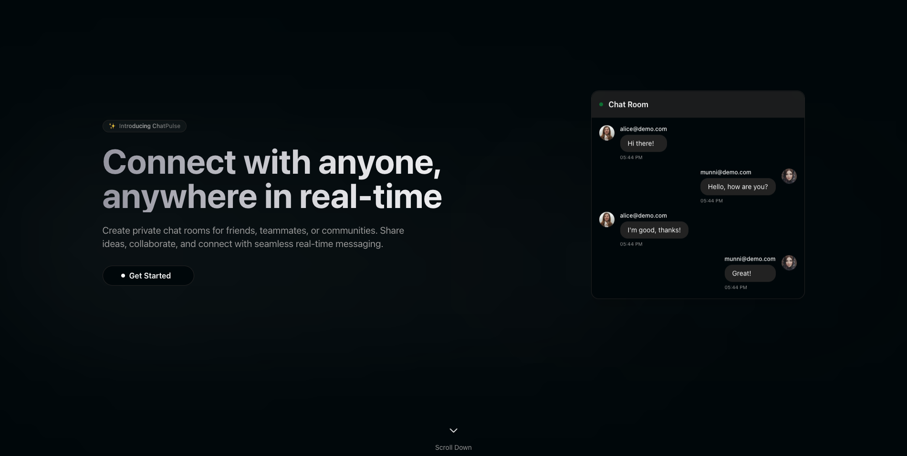

# ChatPulse

A modern real-time chat application built with Next.js and Socket.io.

<p align="center">
  
</p>

## Overview

ChatPulse is a full-stack chat application that enables real-time messaging in a sleek, responsive interface. The application consists of two main components:

1. **Client**: A Next.js application with a modern UI built using Tailwind CSS and shadcn/ui components
2. **Server**: A Node.js/Express backend with Socket.io for real-time communication

## Features

- **Real-time messaging**: Instant message delivery using WebSockets
- **User authentication**: Secure login and registration
- **Chat rooms/groups**: Create and join different chat groups
- **Responsive design**: Works on desktop and mobile devices
- **User presence**: See who's online in real-time
- **Message persistence**: Chat history is saved and loaded from the database

## Tech Stack

### Frontend (Client)
- Next.js 15
- TypeScript
- Tailwind CSS & shadcn/ui
- Socket.io client
- NextAuth.js for authentication
- Zustand for state management
- React Hook Form with Zod validation

### Backend (Server)
- Node.js with Express
- TypeScript
- Socket.io for WebSockets
- Prisma ORM
- Redis for scaling socket connections
- PostgreSQL database

## Getting Started

The application is split into two main directories:

- `/client`: Contains the Next.js frontend application
- `/server`: Contains the Node.js/Express backend

Each directory has its own README with detailed setup and running instructions:

- [Client README](client/README.md)
- [Server README](server/README.md)

### Quick Start

1. **Clone the repository**
   ```bash
   git clone https://github.com/yourusername/chatpulse.git
   cd chatpulse
   ```

2. **Set up the server**
   ```bash
   cd server
   npm install
   # Configure your .env file with database and Redis connections
   npm run dev
   ```

3. **Set up the client**
   ```bash
   cd ../client
   npm install
   # Configure your .env.local file
   npm run dev
   ```

4. **Access the application**
   - Frontend: http://localhost:3000
   - Backend: http://localhost:4000

## Development

For detailed development instructions, please refer to the README files in the respective client and server directories.

## License

[MIT License](LICENSE)
